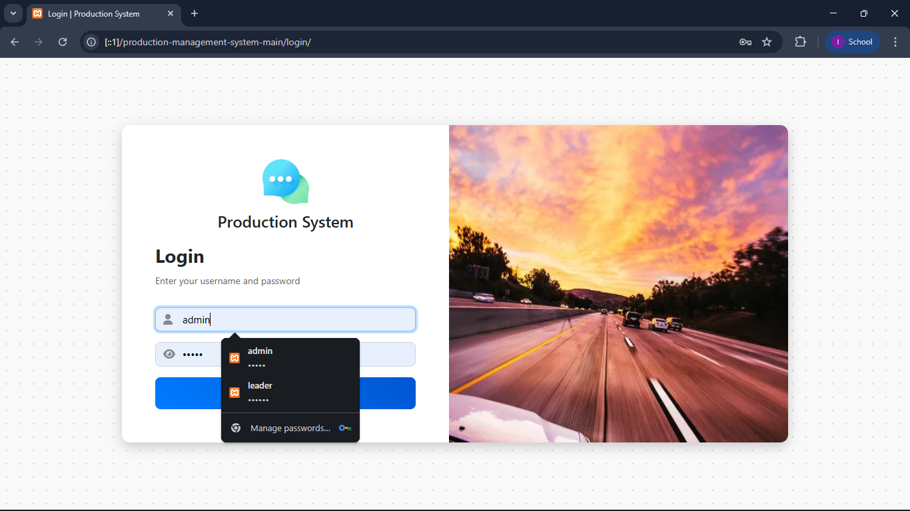
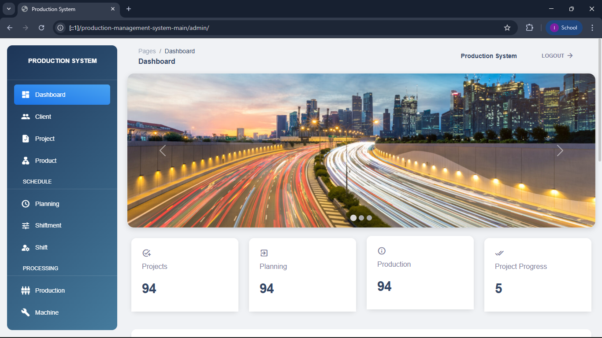
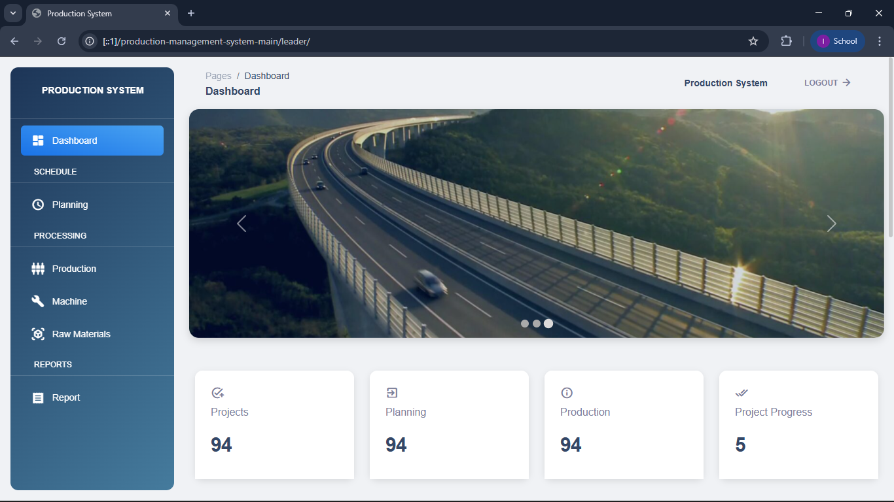

# Production Management System (CodeIgniter)

A web-based system for **production planning, process monitoring, and reporting** in a factory. It manages clients, projects, production plans, shifts, machines, raw materials, production reports, and warehouse summaries.

Developed as a **Praktek Lapang case study** at PT Konsulindo Informatika Perdana, Universitas Pakuan. This project is a fork of the open-source system by [mrezadit](https://github.com/mrezadit), extended and maintained for this case study.

## Features

- **Dashboard**: project, planning, and production summary with a production chart (target vs finished)
- **Client, Project, Product**: master data and client requests
- **Planning and Shiftment**: production plans, shifts, and leader assignment
- **Production**: records the machines and raw materials used per shift
- **Machine and Raw Materials**: status, stock, and usage history
- **Report**: production results (finished goods and waste), printable
- **Warehousing**: total finished goods per project

**User roles:** Admin (full access) and Leader / Shift Head (production, machine, material, and report).

## Production Workflow

1. Admin creates the project and production plan, then assigns it to a shift and leader.
2. Leader clicks **PROCESS**, then records the machines and raw materials used.
3. Once all machines are **FINISHED** and materials are filled, **COMPLETE** becomes available.
4. Leader fills in the **Production Sorting** (finished goods and waste), and the status becomes **Done**.
5. Results appear in **Report**, **Warehousing**, and the dashboard chart.

## Tech Stack

- PHP 8.0 and CodeIgniter 3.1.11 (MVC)
- MariaDB / MySQL
- Apache (XAMPP)
- HTML, CSS, JavaScript, Chart.js

## How to Install

1. Extract the project to `xampp/htdocs`.
2. Start **Apache** and **MySQL** in XAMPP.
3. Create a database named `db_production` in `localhost/phpmyadmin`.
4. Import `db/db_production.sql`.
5. Open `localhost/production-management-system-main`.
6. Log in with the demo accounts in `READMEEE!!!.txt`.

The dashboard (`application/views/admin/Beranda.php`) opens its own database connection, so update it as well if you change the database credentials.

## Screenshot

**Login**

**Dashboard**

**Dashboard**

## Planned Improvements

- Hash passwords (demo passwords are plain text, for local use only)
- Use Query Builder bindings for all queries
- Add foreign key constraints
- Add real-time notifications

## Credits

- **Original system:** [mrezadit](https://github.com/mrezadit)
- **Framework:** [CodeIgniter 3](https://codeigniter.com), MIT License (see `license.txt`)
- **Modified and extended by Ihsan Maulana:** added the Product module and dashboard chart, added COMPLETE button validation, improved the Report feature, and updated the documentation